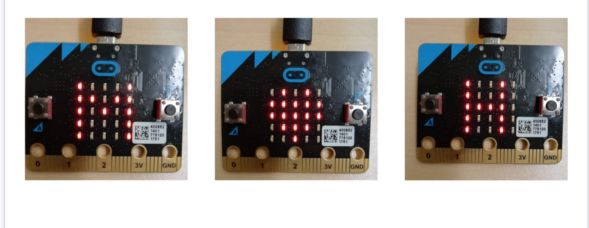

# 文字や模様を表示させてみよう!

## 今回は文字や模様を表示させるぞ!

## MakeCode for micro:bit へ行こう!

まずはmicro:bitのプログラムをどうやって作っていくのかを知ろう!

プログラムを作るにはMicrosoft社が用意している「Microsoft MakeCode」を利用するぞ。

まずはChromeを立ち上げて、「Microsoft MakeCode」と検索しよう!

